# API Protector Manual

## Accessing the Panel

On your desktop, open a browser (Firefox or Chrome, recommended: Firefox) and enter the following address.
https://localhost:18443

- You will get a self-signed certificate error message.  Click the `Advanced` button and then click the `Accept the Risk and Continue` button.

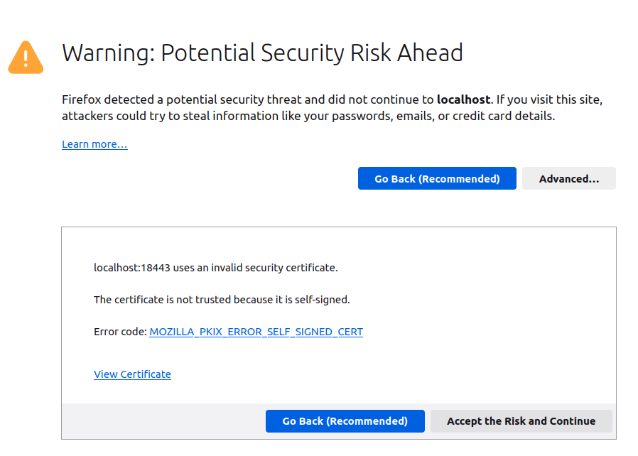

- Then, the panel with show the user account creation page. Fill out the form with username, password, and email address. 

Note: The email address is just for user creation. It is not used or uploaded to any external server.

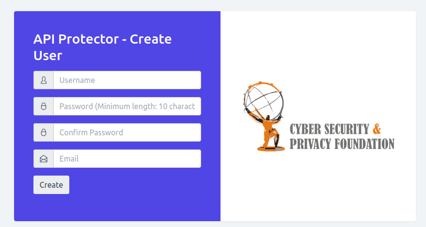
 
- Once created you will get a login page, you can provide the username and password to log in. Once logged in, you can see the API Protector home page.

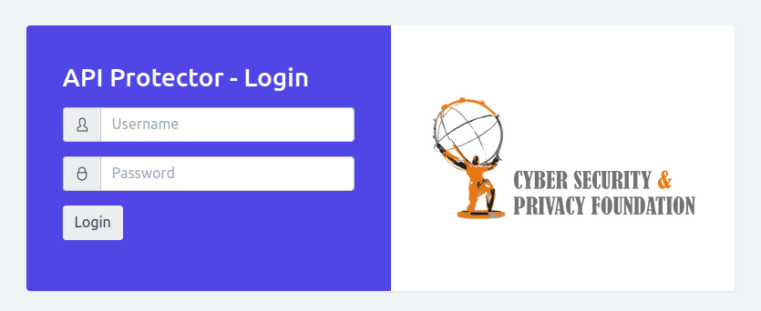

## How to protect an API Endpoint?

### Prerequisites

Before you begin, make sure you have the following:

- An OpenAPI definition file (.yaml or .yml format) for the target API.
- Target API URL.


### Steps

### Login

- Open a web browser and navigate to the API Protector panel.
- Enter your login credentials to access your account.

### Go to add API Protector page

- From the side menu, locate and click on the `Add API Protector` option. This will take you to the Add API Protector page.

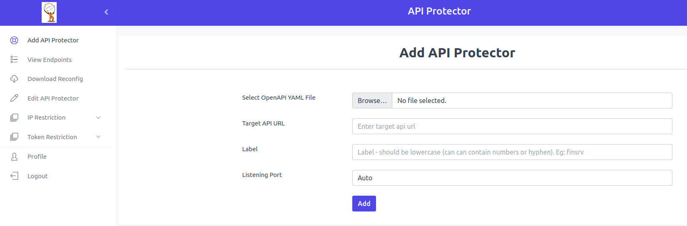 

### Select the OpenAPI YAML File

- On the Add Scan page, you will find a `Select OpenAPI File` section.
- Click on the `Browse` button next to the `Select OpenAPI File` field.
- In the file selection dialog, navigate to the location where the OpenAPI file is stored.
- Select the appropriate file (.yaml or .yml format) and click `Open`.

### Target API URL

You have to specify the target API URL that you intend to protect. Ensure the API URL is reachable from the API Protector machine. 

```
Note: If the URL is unreachable, it will display 'UnableToReach API Server: connection refused or host unreachable' error.
```
### Naming the Label

- Labelling Endpoint is for your reference.
- The label should be unique.
- Recommended to be in lowercase.
- Allowed characters are alphanumeric and hyphens. 

Example: apiserv or api-server

### Listening Port

- The listening port will be used to actively monitor and accept incoming requests from the clients and forward them to the target API.
- By default, the listening port is set to Auto. API Protector will assign ports automatically to the individual label.
- If you want to assign a port specifically, then you can choose the `custom` option to give the port which should be above 1024.

```
Note: Port numbers should be unique. It will display an error if the port number is already used.
```

### Add the Endpoint

Click on the `Add` button to submit the form. Once the Endpoint is added successfully, it will display a `success` message.   


## View API Protector Endpoints

To view already added Endpoints, click on the `View Endpoints` option from the side menu.

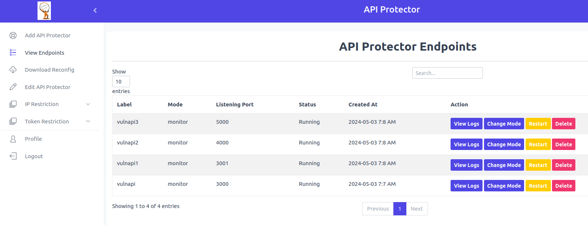

To access the protected API server in your web browser, you'll need the IP address and the port it's listening on. 

To obtain the IP address from the VM machine, execute the following command:

```bash
ip a
```

After running the command, you'll receive output similar to the image below:

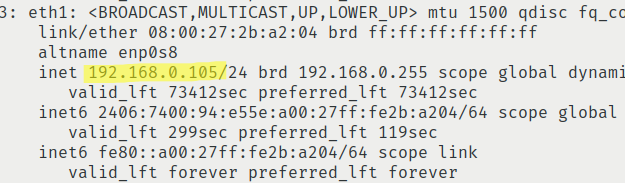

You can find the port information for the corresponding endpoints within the panel.

For example, if the IP address is `192.168.0.105` and the port is `3000`, then the URL will be http://192.168.0.105:3000.

Each row represents a specific label and includes the following information:

### Label

Reference name that we entered while adding API Protector Endpoint.

### Mode

Displays the current mode of the Endpoint.

- There are two modes, one is monitor, and the other is block. By default, it will be in monitor mode. 
- In monitor mode, the API protector just logs the requests and detections.
- In Block mode, if a request doesn't match the criteria specified in the YAML file, the firewall blocks it, preventing it from reaching the API server.

### Listening Port

Displays the listening port number.

### Status

Shows the current status of the Endpoints.

### Action

Under this, there will be three options.

#### View Logs
You can view and download logs.

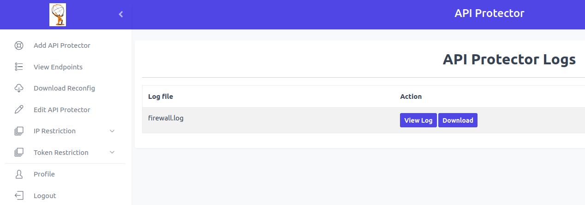

In this, you can view logs by clicking on the `view log` option.

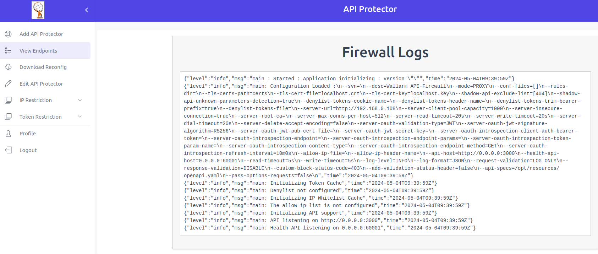
     
Also, you can download the log file by clicking on the `download` option.

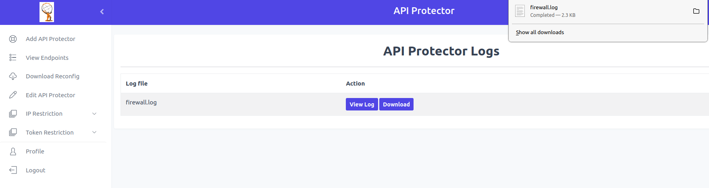

#### Change Mode

You can change the mode in this option. Choose either `block` or `monitor` mode, then click on `update` to apply changes.

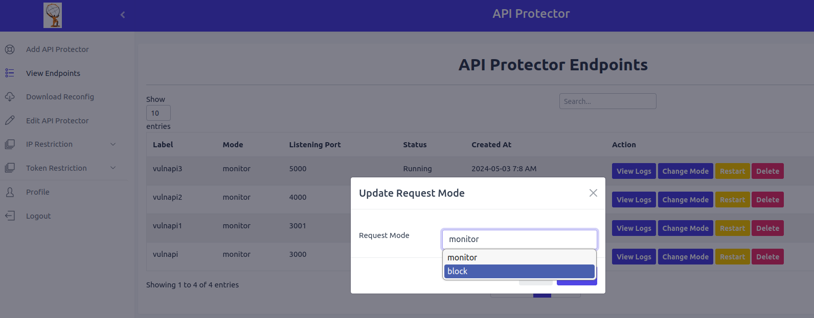 

#### Restart

If you wish to manually restart the endpoint after making changes, you can click the `Restart` option.

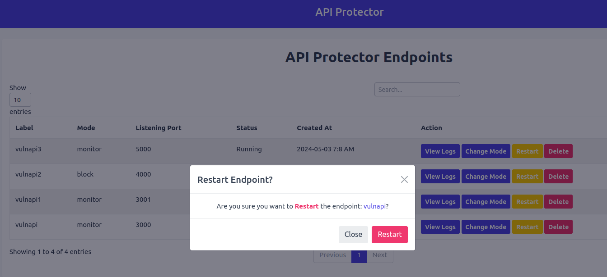 

#### Delete

If you want to remove the API Protector Endpoint which is not needed, then you can delete it through this option. Make sure you click on the connect label because once deleted, it cannot be retrieved.

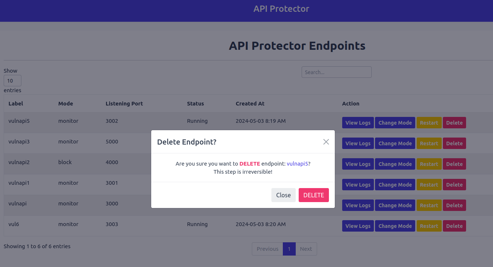 

Once deleted, it will display a message `Successfully deleted the endpoint`.


## Download Reconfig

In an API firewall, you can download a reconfig zip file containing an OpenAPI YAML file and firewall logs. By analyzing these logs, you can identify detections and make adjustments to the OpenAPI YAML file if needed.
    
To download the reconfig zip file, click on the `Download Reconfig` option from the side menu. Then click the `Download Reconfig` button next to the corresponding label.

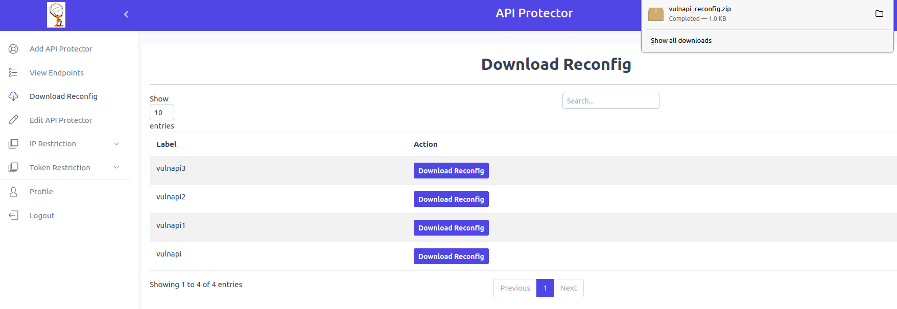 


## Edit API Protector

In this menu, you can edit the API Endpoint Protector. You have to click on `Edit API Protector` to edit the label. 

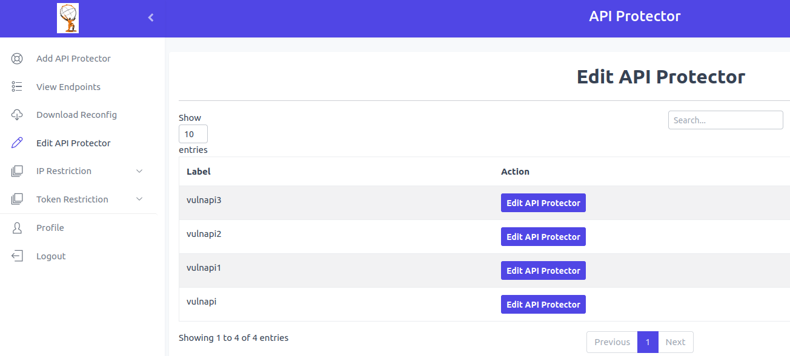

- You can change the OpenAPI YAML file if there are new specifications. To change the YAML file, you have to click on choose file option, then navigate and select the new OpenAPI YAML file.
- You can also update the target API URL.
- You can also change the firewall request mode from monitor to block or vice versa.
- Then click on `Update` to save your changes.

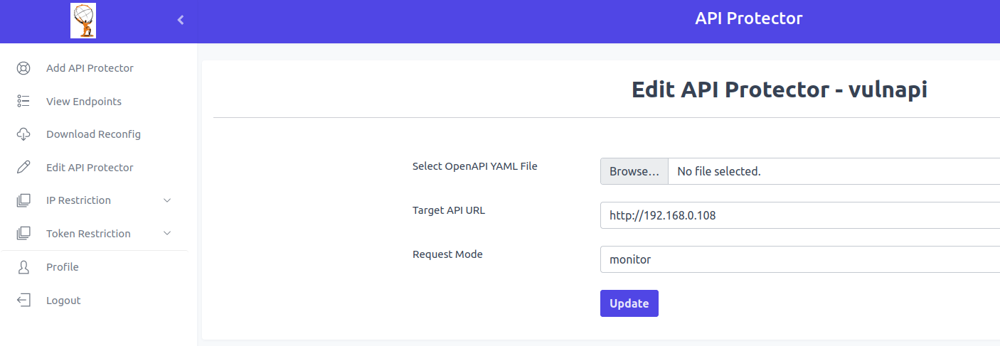


## IP Restriction

Within the IP Restriction menu, you can specify which IP addresses are allowed to access the API Server, thereby restricting access from all other IPs. 
 
The menu has two sections: IP Header and Allowed IPs, each containing 'Save' and 'Save & Restart' buttons.

- **Save Option:** This preserves changes without restarting the endpoint. However, to apply these changes, you must manually restart the endpoint by clicking the corresponding `Restart` option in the View endpoints side menu. Otherwise, the changes won't take effect.
- **Save & Restart Option:** This applies changes and restarts the endpoint immediately. 

### IP Header

In IP Header, you can add IP headers for API requests, like X-Forwarded-For or X-Client-IP. You can select `Save` or `Save & Restart` to apply the changes.

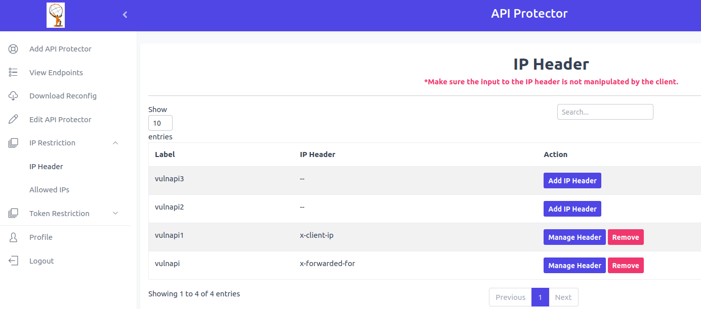 

```
Note: Make sure the input to the IP header cannot be manipulated by the client.
```

To add the IP header for the endpoint, click the `Add IP Header`, then select the IP header and click `Save` or `Save & Restart`. You can also provide a custom IP header for the endpoint.

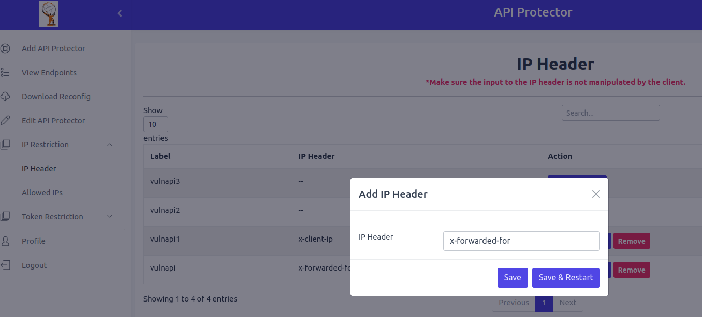 

If you want to modify the IP Header, click on `Manage Header`, then change the IP header. After updating the changes, click `Save` or  `Save & Restart`.

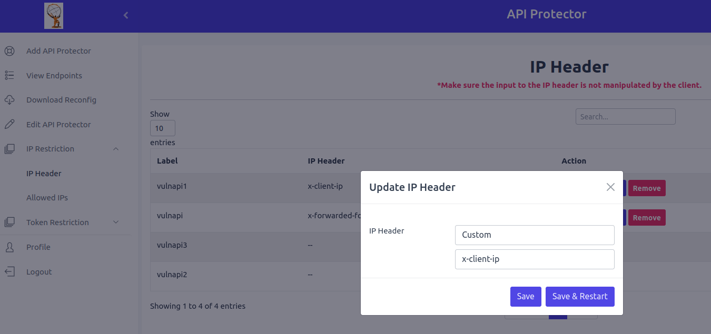

To remove the IP header, click `Remove` and then click on `Delete`. Once removed, it will display a success message.

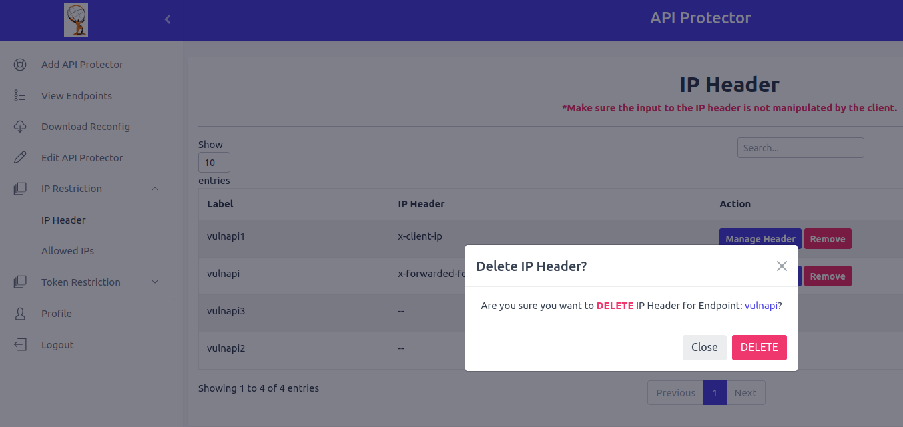


### Allowed IP List

Within the Allowed IP List section, you can add or view the list of allowed IPs to access the API Server. 

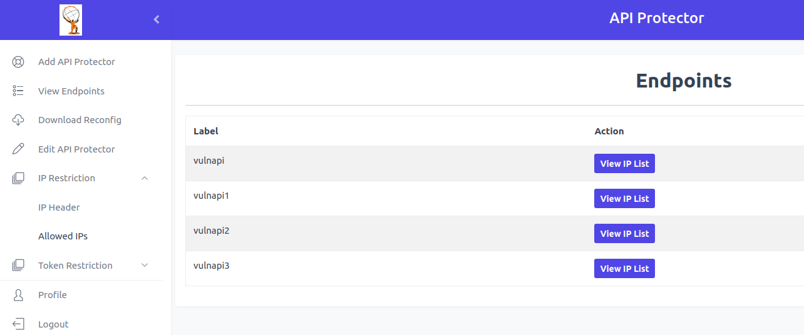

By clicking on `View IP List` within the specific endpoint, you can see the list of allowed IP addresses for the endpoint.

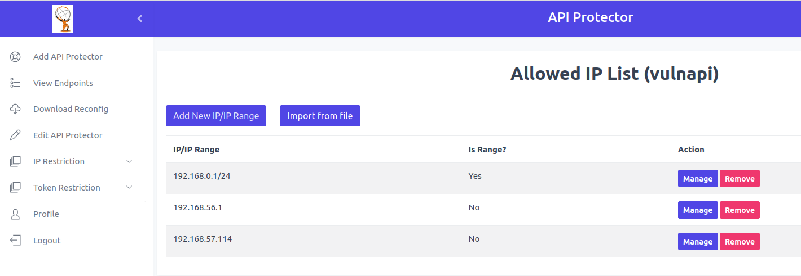

```
Note: If the IP header is not set, it will automatically default to the client IP from the HTTP request.
```

To add the IP address for the endpoint, you can click on `Add New IP/IP range`, then enter the IP/IP range and click on `Save` or `Save & Restart`.

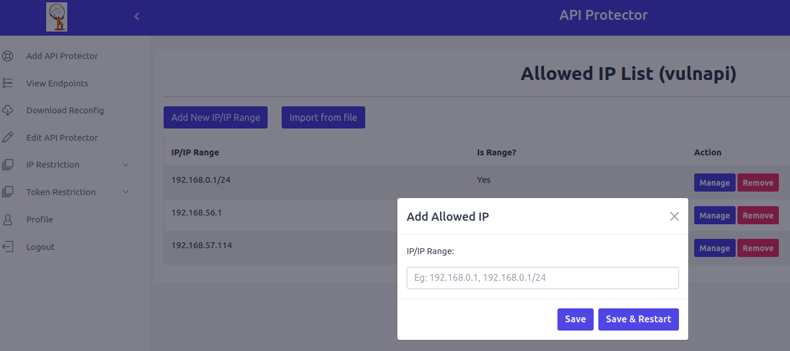

If you wish to modify the allowed IP for the endpoint, click on `Manage`, then change the IP address and click `Save` or `Save & Restart`.

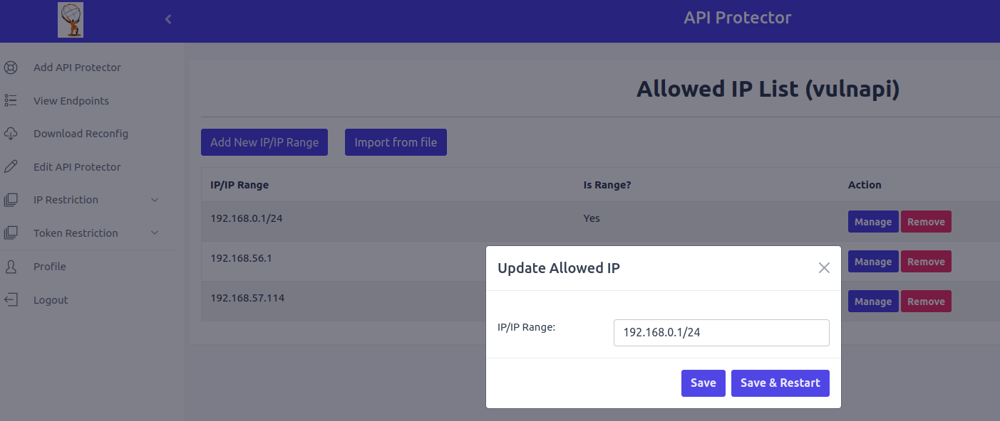

To remove the allowed IP for a specific endpoint, click `Remove` and then select `Remove`. Once removed, it will display a success message.

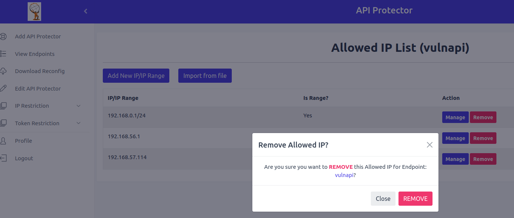


## Token Restriction

Within this menu, you can add tokens to be denied while sending HTTP requests to the API server, such as expired/compromised tokens.

This menu comprises two sections: `Deny Token header` and `Deny Tokens`, each containing `Save` and `Save & Restart` options.

- **Save Option:** This preserves changes without restarting the endpoint. However, to apply these changes, you must manually restart the endpoint by clicking the corresponding `Restart` option in the View endpoints side menu. Otherwise, the changes won't take effect.
- **Save & Restart Option:** This applies changes and restarts the endpoint for immediate effect. For example, if you wish to modify the token or token header, you can do so and then click `Save & Restart` for the changes to take place immediately.

### Deny Token Header

Within this section, you can add and manage the deny token headers for accessing the endpoint.

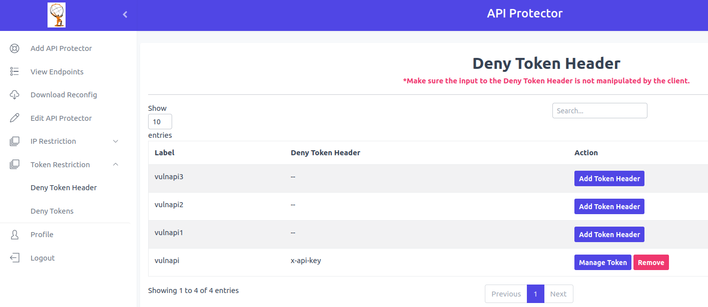

To add the deny token header, click the `Add` button, then select the token header and click on `Save` or `Save & Restart`. You can also give a custom value.

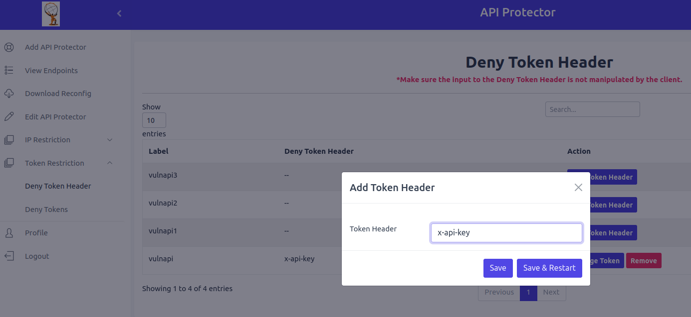

To update the token header, click on `Manage`, then change the token header and click `Save` or `Save & Restart` to apply the changes.

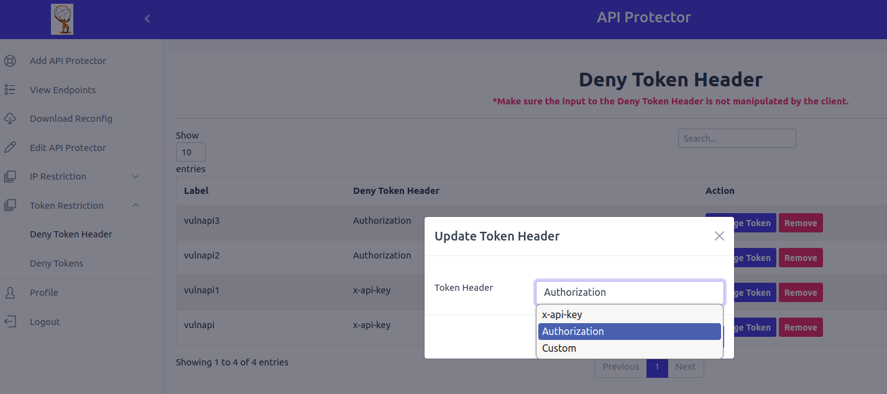

To delete the deny token header for the endpoint, click on `Remove` and then select `Delete`. Once removed, it will display a success message.

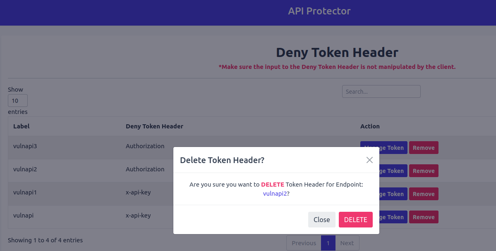

## Deny Tokens

Within this section, you can add and manage deny tokens to access the endpoint.

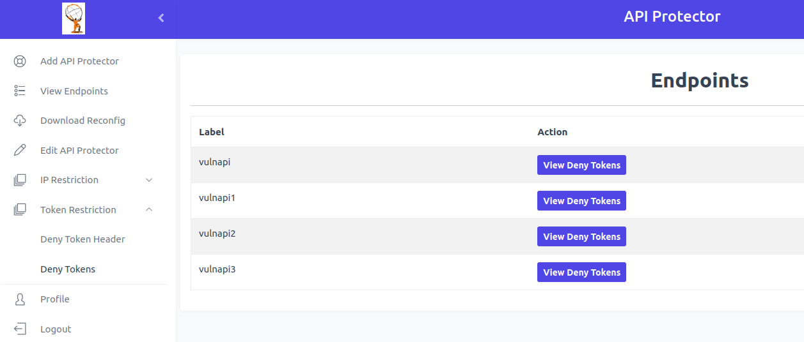

To view denied tokens, click on `View Deny Tokens`.

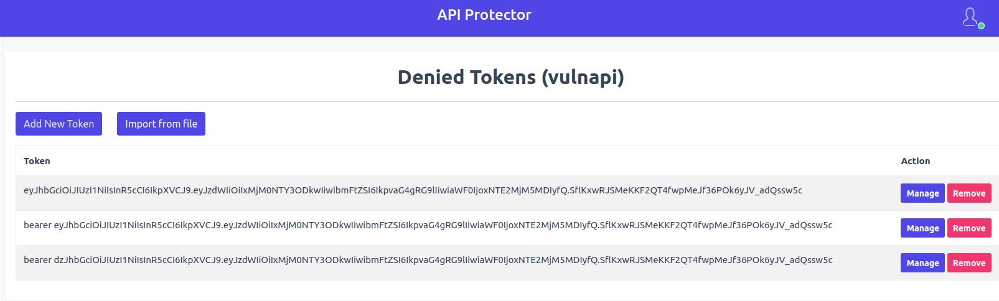


To add the denied tokens, click the `Add New Token` or import from a file using `Import from file`. Then click on `Save` or `Save & Restart`.

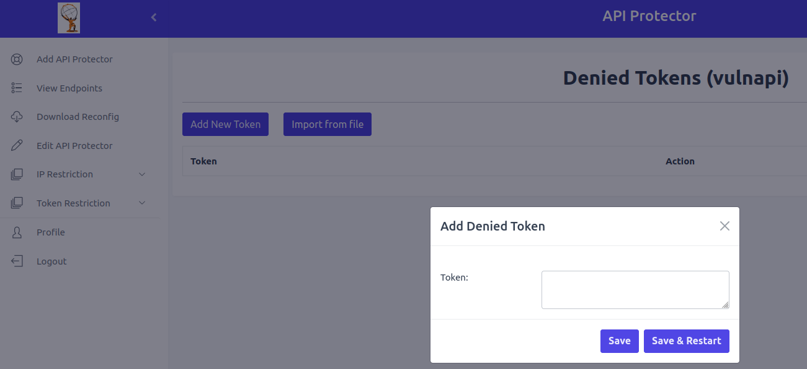

If you wish to modify the token, click `Manage` to edit the token. Then click the `Save` or `Save & Restart` to apply the changes.

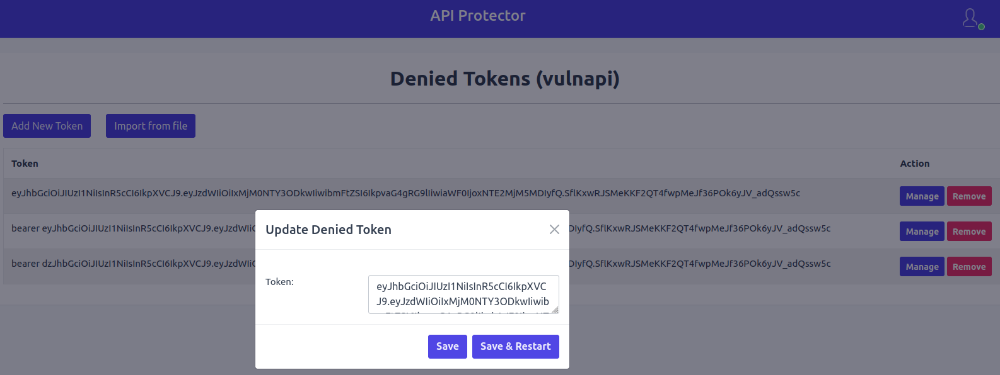

To remove the added token, click `Remove` and then select `Remove`. Once removed, it will display a success message.

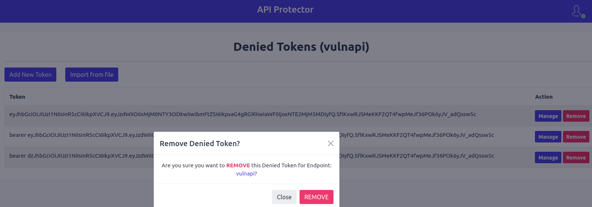


## Profile

In the view menu, you can see the name, username, and email address.

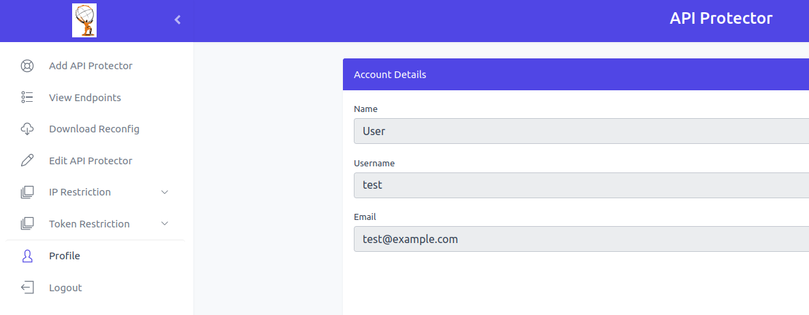

## Logout

You can click on `Logout` to logout from the panel.

## Forgot Password

- In case of a forgotten password you will need to destroy and rebuild the VM per the below step. And then go through the setup again.

    ```
    vagrant destroy apiprotectorvm
    ```
